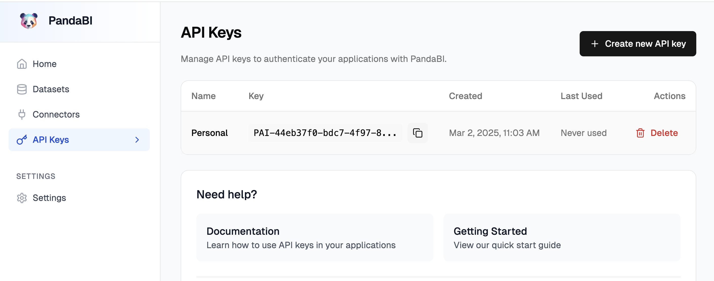
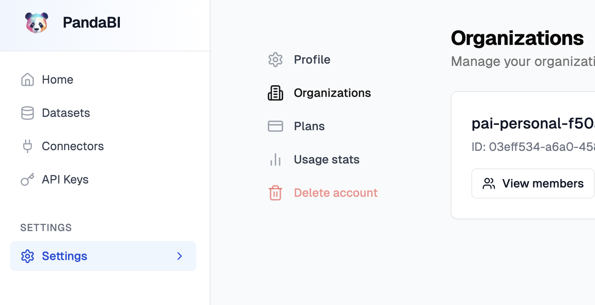

# Pandas AI Application

Esta aplicación utiliza Pandas AI para cargar y procesar datasets de jugadores de la NBA. Los datos se cargan desde un archivo CSV y podemos analizarlos en:

1) local (se necesita una key de OpenAI)
2) cloud PandasAI (se necesita una key de PandasAI y el id de la account de PandasAI)

## Configuración

Para configurar la aplicación, es necesario crear un archivo `.env` en el directorio raíz del proyecto y añadir las siguientes variables de entorno:

#### OPEN_AI_KEY=<tu_secreto_OpenAI> 

#### PANDAS_AI_KEY=<tu_secreto_PandasAI>

#### PANDAS_AI_ACCOUNT = <tu_cuenta_PandasAI> (pai-personal-XXXXX)

Estas claves son necesarias para autenticarte con el servicio de Pandas AI y poder cargar y subir datasets.

## Uso

1. Clona el repositorio y navega al directorio del proyecto.
2. Crea el archivo `.env` y añade las variables de entorno mencionadas anteriormente.
3. Ejecuta el notebook `talent-arena.ipynb` para cargar y procesar los datos.